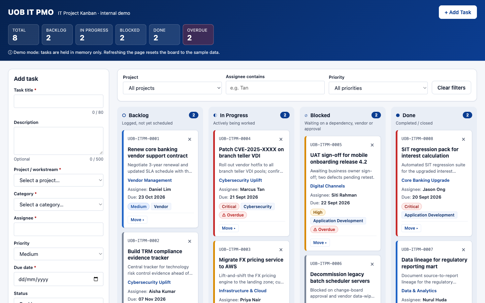

# UOB IT PMO — Kanban Board

A single-page IT project Kanban board built with vanilla HTML, CSS and JavaScript in one file. This is an **internal demo/training tool**. It is not affiliated with, and does not imitate, any official UOB system.

**Live site:** https://adisuwarno-maker.github.io/kanban4/



## Features

- **Four columns:** Backlog, In Progress, Blocked and Done, each with a live task count.
- **Task cards** show the ID (`UOB-ITPM-####`), title, project, assignee, due date, category tag and priority pill. The left border is colour-coded by priority: Critical is red, High is amber, Medium is blue and Low is grey.
- **Drag and drop** between columns uses native HTML5 DnD, and the column under the cursor is highlighted. Each card also has a keyboard-accessible **Move ▸** control.
- **Overdue badge** on tasks that are past due and not Done.
- **Inline delete** asks "Delete? Yes / No" on the card, with no browser dialogs.
- **Add Task form** with inline validation: the title is required (max 80 characters), the description is optional (max 500), the assignee is required, and the due date cannot be in the past.
- **Filters** by project, assignee (contains) and priority.
- **Summary strip** showing total tasks, the count per status, and overdue tasks.
- **Email notifications** for new tasks via [FormSubmit](https://formsubmit.co). The UI is optimistic: if the email fails, the card stays and a warning toast appears.

## Run locally

Open `index.html` in a browser. There is no build step, server or dependency.

## Configure email notifications

1. In `index.html`, set the constant at the top of the `<script>` block:
   ```js
   const FORMSUBMIT_ENDPOINT = "https://formsubmit.co/ajax/you@example.com";
   ```
   Until the placeholder is replaced, no request is sent and adding a task shows a "notification failed" warning.
2. **One-time activation:** the first submission sends a confirmation email to that address. Click the link in it, and later submissions will be delivered.

> The repo is public, so any address you put here is publicly visible.

## Data

Board state is kept **in memory only**, with no localStorage, cookies or backend. Refreshing the page resets the board to 8 seeded demo tasks, which is intended.

## Deployment

On every push to `main`, the [Pages workflow](.github/workflows/pages.yml) deploys the repo root to GitHub Pages. The repo's Pages source must be set to **GitHub Actions** under *Settings → Pages*.
